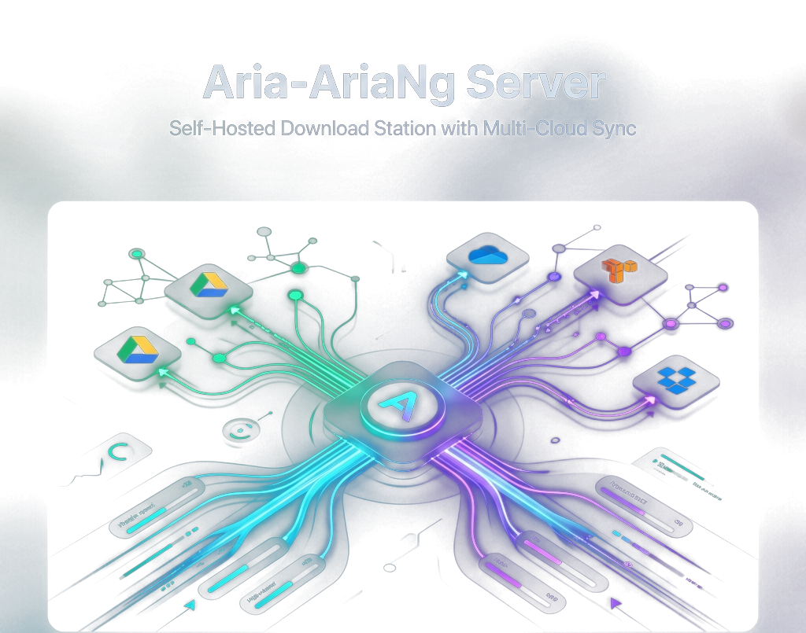

<div align="center">



# 🚀 Aria-AriaNg Server

### **Self-Hosted Download Station with Multi-Cloud Sync**

[](LICENSE)
[](https://hub.docker.com/u/baba2580)
[](docker-compose.yml)
[](https://aria2.github.io/)
[](aria2-nginx.conf)
[](#deploy-on-oracle-cloud-vps)

<br/>

> **⚡ A production-ready, fully automated download server** that fetches files via HTTP/FTP/BitTorrent,
> syncs them to 70+ cloud providers, and gives you a beautiful real-time dashboard — all behind
> SSL-secured Nginx with HTTP basic auth.

<br/>

[](https://www.docker.com/)
[](https://nodejs.org/)
[](https://rclone.org/)
[](https://letsencrypt.org/)
[](#features)

</div>

---

## 📑 Table of Contents

- [✨ Features](#features)
- [🏗️ Architecture](#architecture)
- [🧩 Stack Components](#stack-components)
- [🌐 Services & Access](#services--access)
- [📋 Prerequisites](#prerequisites)
- [📘 Deployment Guide](#deployment-guide)
- [⚡ Quick Start](#quick-start)
- [🐳 Deploy with Docker Hub](#deploy-with-docker-hub)
- [☁️ Deploy on Oracle Cloud VPS](#deploy-on-oracle-cloud-vps)
- [☁️ Multi-Cloud Upload](#multi-cloud-upload)
- [⚙️ Configuration Reference](#configuration-reference)
- [🤖 Automated Features](#automated-features)
- [🔧 Maintenance & Commands](#maintenance--commands)
- [🛡️ Security Architecture](#security-architecture)
- [🗂️ Project Structure](#project-structure)
- [📜 License](#license)

---

<a id="features"></a>
## ✨ Features

<table>
<tr>
<td width="50%">

### 🔽 Multi-Protocol Downloads
> **HTTP, HTTPS, FTP, SFTP, BitTorrent & Magnet Links** — all managed effortlessly through a single high-performance web interface.

</td>
<td width="50%">

### ☁️ Multi-Cloud Sync
> **Automatic Cloud Uploads** to OneDrive, Google Drive, Dropbox, MEGA, Amazon S3, and **70+ cloud providers** powered by Rclone.

</td>
</tr>
<tr>
<td width="50%">

### 📊 Real-Time Dashboard
> **Live Monitoring Dashboard** with real-time download/upload speeds, active connections, server RAM/CPU, disk usage, and cloud capacity via WebSocket.

</td>
<td width="50%">

### 🔒 Enterprise SSL + Auth
> **Automated Let's Encrypt Certificates** with auto-renewal and mandatory HTTP Basic Authentication protecting all routes.

</td>
</tr>
<tr>
<td width="50%">

### 🐳 Fully Dockerized Stack
> **One-Command Deployment** with Docker Compose orchestrating 7 microservices with zero manual server configuration.

</td>
<td width="50%">

### 🧹 Automated Cleanup
> **Post-Upload File Hygiene** automatically purges `.aria2` temp files, `.torrent` metadata, and empty directories upon cloud sync completion.

</td>
</tr>
<tr>
<td width="50%">

### 📡 Daily BT Tracker Updates
> **Auto-Refreshing BitTorrent Trackers** updated daily at 4 AM from top community-maintained tracker repositories.

</td>
<td width="50%">

### 💾 Cloud Config Backups
> **Automated Disaster Recovery** backing up your system configuration files to cloud storage daily at 3 AM.

</td>
</tr>
</table>

---

<a id="architecture"></a>
## 🏗️ Architecture

```
┌─────────────────────────────────────────────────────────────────────┐
│                        NGINX REVERSE PROXY                          │
│                  (SSL termination + Basic Auth)                      │
│       :80 (HTTP→HTTPS)         :443 (HTTPS)                        │
├─────────┬──────────┬──────────┬───────────┬─────────────────────────┤
│    /    │ /jsonrpc  │/download │/portainer │  /live     /rclone     │
│         │          │          │           │                         │
│ AriaNg  │ Aria2    │ File     │ Portainer │  Nexly     Rclone      │
│  (SPA)  │   RPC    │ Browser  │    UI     │ Dashboard  Web GUI     │
└────┬────┴────┬─────┴────┬─────┴─────┬─────┴─────┬───────┬──────────┘
     │         │          │           │           │       │
     │    ┌────▼────┐  ┌──▼────┐  ┌───▼───┐  ┌───▼───┐   │
     │    │ Aria2   │  │ File  │  │Portai-│  │ Nexly │   │
     │    │  Pro    │  │Browser│  │ner CE │  │  Dash │   │
     │    │ :6800   │  │  :80  │  │ :9000 │  │ :3000 │   │
     │    └────┬────┘  └───────┘  └───────┘  └───┬───┘   │
     │         │                                  │       │
     │         │  ┌─────────────┐                 │       │
     │         └──►  Downloads  ◄─────────────────┘       │
     │            │   Volume    │                          │
     │            └──────┬──────┘                          │
     │                   │                                 │
     │            ┌──────▼──────┐                          │
     │            │   Rclone    ◄──────────────────────┘
     │            │   :5572     │
     │            └──────┬──────┘
     │                   │
     │     ┌─────────────▼─────────────┐
     │     │     Cloud Providers       │
     │     │  OneDrive │ Google Drive  │
     │     │  Dropbox  │ MEGA │ S3    │
     │     │     + 70 more via Rclone  │
     │     └───────────────────────────┘
     │
     │            ┌────────────┐
     └────────────► Certbot    │
                   │ (SSL Auto) │
                   └────────────┘
```

---

<a id="stack-components"></a>
## 🧩 Stack Components

| Component | Container Image | Primary Purpose |
| :--- | :--- | :--- |
| 🔽 **Aria2 Pro** | [`baba2580/aria2-pro`](https://hub.docker.com/r/baba2580/aria2-pro) | High-speed multi-threaded download engine |
| 🎨 **AriaNg** | `nginx:alpine` (static) | Modern web GUI frontend for Aria2 RPC |
| ☁️ **Rclone** | `rclone/rclone` | Multi-cloud transfer and sync engine |
| 📁 **FileBrowser** | `filebrowser/filebrowser` | Web-based file manager & previewer |
| 🐳 **Portainer** | `portainer/portainer-ce:lts` | Visual container management dashboard |
| 🌐 **Nginx** | `nginx:alpine` | Reverse proxy, SSL termination & HTTP Basic Auth |
| 📊 **Nexly Dashboard** | [`baba2580/nexly-dashboard`](https://hub.docker.com/r/baba2580/nexly-dashboard) | Real-time WebSocket monitoring & cloud manager |
| 🔐 **Certbot** | `certbot/certbot` | Automated Let's Encrypt SSL certificate issuance |

---

<a id="services--access"></a>
## 🌐 Services & Access

> [!NOTE]
> All web routes are secured behind **HTTP Basic Authentication** (`.htpasswd`). Insecure HTTP requests on port 80 are automatically upgraded to **HTTPS** on port 443.

| Service | Public Route | Port | Authentication | Description |
| :--- | :--- | :---: | :---: | :--- |
| 🎨 **AriaNg Web UI** | `/` | `443` | Basic Auth | Complete download station control center |
| ⚡ **Aria2 RPC Endpoint** | `/jsonrpc` | `443` | RPC Secret | WebSocket RPC API for desktop/mobile clients |
| 📊 **Nexly Dashboard** | `/live/` | `443` | Basic Auth | Real-time server health & cloud destinations GUI |
| 📁 **FileBrowser** | `/download/` | `443` | Basic Auth + Web UI | Direct file manager to browse & stream downloads |
| 🐳 **Portainer UI** | `/portainer/` | `443` | Basic Auth + Portainer | Full Docker container & log management |
| ☁️ **Rclone Web GUI** | `/rclone/` | `443` | Basic Auth + Rclone | Advanced cloud remote management |

---

<a id="prerequisites"></a>
## 📋 Prerequisites

| Requirement | Minimum Specification | Recommended Specification |
| :--- | :--- | :--- |
| **Operating System** | Ubuntu 20.04 LTS / Debian 11 | Ubuntu 22.04 LTS / Oracle Linux 8+ |
| **RAM** | 1 GB | 2 GB+ |
| **Storage** | 20 GB free disk space | 50 GB+ High-speed NVMe SSD |
| **Docker** | Engine v20.10+ | Latest Stable Docker Engine |
| **Docker Compose** | v2.0+ | Latest Docker Compose Plugin |
| **Domain Name** | Any domain with DNS `A Record` | Cloudflare / DDNS supported |
| **Network Ports** | Ports `80` and `443` open | Standard HTTP/HTTPS inbound |

---

<a id="deployment-guide"></a>
## 📘 Deployment Guide

> [!TIP]
> **First time deploying?** Follow the step-by-step **[Deployment Guide](DEPLOYMENT.md)** — it covers everything from getting a server to verifying your deployment, with detailed explanations for each step.
>
> The Quick Start below is a condensed reference for experienced users.

---

<a id="quick-start"></a>
## ⚡ Quick Start

### Option 1: One-Command Automated Deployment (Recommended)

On any fresh Ubuntu or Debian VPS:

```bash
curl -fsSL https://raw.githubusercontent.com/Akai-Abd/Aria-Ariang-Server/main/deploy.sh | bash
```

---

### Option 2: Fast Manual Setup with `setup.sh`

```bash
# 1. Clone the repository
git clone https://github.com/Akai-Abd/Aria-Ariang-Server.git
cd Aria-Ariang-Server

# 2. Run pre-flight setup (pre-creates DBs, sets 775 permissions, generates certs)
chmod +x setup.sh check.sh deploy.sh
./setup.sh

# 3. Launch stack
docker compose up -d
```

> Pre-built images are pulled automatically from [Docker Hub](https://hub.docker.com/u/baba2580). No `--build` flag needed.

### <kbd>Step 4</kbd> — Issue Production Let's Encrypt SSL (Optional)

```bash

# Obtain official SSL certificate via Certbot
docker compose run --rm certbot certonly \
  --webroot -w /var/www/certbot \
  -d your.domain.com \
  --email your@email.com \
  --agree-tos --no-eff-email

# Update Nginx config to point to Let's Encrypt certificates
nano aria2-nginx.conf
# Set:
#   ssl_certificate /etc/letsencrypt/live/your.domain.com/fullchain.pem;
#   ssl_certificate_key /etc/letsencrypt/live/your.domain.com/privkey.pem;

# Reload Nginx
docker compose restart nginx-proxy
```

### <kbd>Step 5</kbd> — Verify Deployment Status

```bash
# Check container status
docker compose ps

# Run health check diagnostic
bash check.sh
```

---

<a id="deploy-with-docker-hub"></a>
## 🐳 Deploy with Docker Hub

> [!TIP]
> This project publishes **pre-built, multi-architecture Docker images** to Docker Hub. You don't need to build anything — just pull and run.

### Docker Hub Images

| Image | Architectures | Docker Hub |
| :--- | :---: | :--- |
| `baba2580/aria2-pro` | `amd64` / `arm64` | [hub.docker.com/r/baba2580/aria2-pro](https://hub.docker.com/r/baba2580/aria2-pro) |
| `baba2580/nexly-dashboard` | `amd64` / `arm64` | [hub.docker.com/r/baba2580/nexly-dashboard](https://hub.docker.com/r/baba2580/nexly-dashboard) |

> The remaining 5 services (`nginx:alpine`, `rclone/rclone`, `filebrowser/filebrowser`, `portainer/portainer-ce:lts`, `certbot/certbot`) are official images pulled directly from Docker Hub — no custom build needed.

---

### <kbd>Step 1</kbd> — Clone the Repository

The repo contains configuration files, scripts, and the AriaNg web frontend that Docker containers need via volume mounts.

```bash
git clone https://github.com/Akai-Abd/Aria-Ariang-Server.git
cd Aria-Ariang-Server
```

### <kbd>Step 2</kbd> — Configure Environment

```bash
# Copy template and edit with your values
cp .env.example .env
nano .env
```

Set each variable:

```env
RPC_SECRET=your_secure_rpc_secret       # Aria2 RPC token (used by AriaNg to connect)
RCLONE_USER=admin                        # Rclone Web GUI username
RCLONE_PASS=your_secure_password         # Rclone Web GUI password
FB_USER=admin                            # FileBrowser username
FB_PASS=your_secure_password             # FileBrowser password
TZ=Asia/Kolkata                          # Your server timezone
PUID=1001                                # Linux User ID for file permissions
PGID=1001                                # Linux Group ID for file permissions
DOMAIN=your.domain.com                   # Your domain name
```

### <kbd>Step 3</kbd> — Set Up HTTP Basic Authentication

This password protects all web routes (AriaNg, Dashboard, FileBrowser, Portainer, Rclone).

```bash
# Install htpasswd utility (one-time)
sudo apt install apache2-utils -y

# Create password file — replace 'admin' and 'yourpassword' with your credentials
htpasswd -cb .htpasswd admin yourpassword
```

### <kbd>Step 4</kbd> — Generate SSL Certificate

Nginx requires an SSL certificate to start. Create a temporary self-signed one first:

```bash
mkdir -p certs
openssl req -x509 -nodes -days 365 \
  -newkey rsa:2048 \
  -keyout certs/aria2.key \
  -out certs/aria2.pem \
  -subj "/CN=your.domain.com"
```

> [!NOTE]
> After deployment, you'll replace this with a real Let's Encrypt certificate via Certbot (Step 6).

### <kbd>Step 5</kbd> — Deploy

```bash
docker compose up -d
```

Docker will automatically:
1. **Pull** `baba2580/aria2-pro:latest` and `baba2580/nexly-dashboard:latest` from Docker Hub
2. **Pull** `nginx:alpine`, `rclone/rclone`, `filebrowser/filebrowser`, `portainer/portainer-ce:lts`, `certbot/certbot`
3. **Start** all 7 containers on an isolated Docker bridge network
4. **Expose** only ports `80` and `443` to the internet

```
Expected output:
 ✔ Network aria2-net             Created
 ✔ Container aria2-pro           Started
 ✔ Container nginx-proxy         Started
 ✔ Container rclone              Started
 ✔ Container filebrowser         Started
 ✔ Container portainer           Started
 ✔ Container nexly-dashboard     Started
 ✔ Container certbot             Started
```

### <kbd>Step 6</kbd> — Get Real SSL Certificate

Once containers are running and your domain's DNS `A` record points to your server IP:

```bash
# Request Let's Encrypt certificate
docker compose run --rm certbot certonly \
  --webroot -w /var/www/certbot \
  -d your.domain.com \
  --email your@email.com \
  --agree-tos --no-eff-email

# Update Nginx to use the real certificate
nano aria2-nginx.conf
```

Change the SSL lines to:

```nginx
ssl_certificate /etc/letsencrypt/live/your.domain.com/fullchain.pem;
ssl_certificate_key /etc/letsencrypt/live/your.domain.com/privkey.pem;
```

Then reload Nginx:

```bash
docker compose restart nginx-proxy
```

### <kbd>Step 7</kbd> — Verify Everything Works

```bash
# Check all containers are running
docker compose ps

# Run the built-in health check
bash check.sh
```

Access your services at:

| Service | URL |
| :--- | :--- |
| **AriaNg** (Download UI) | `https://your.domain.com/` |
| **Nexly Dashboard** | `https://your.domain.com/live/` |
| **FileBrowser** | `https://your.domain.com/download/` |
| **Portainer** | `https://your.domain.com/portainer/` |
| **Rclone Web GUI** | `https://your.domain.com/rclone/` |

---

### Updating to a New Version

When a new release is published, update your deployment:

```bash
cd Aria-Ariang-Server

# Pull latest config changes
git pull

# Pull latest Docker Hub images and restart
docker compose pull
docker compose up -d
```

> [!NOTE]
> Your downloads, configurations, rclone tokens, and cloud destinations are stored in local volumes — they are **never affected** by image updates.

---

### Pinning a Specific Version

To lock your deployment to a specific release instead of `latest`:

```bash
# Edit docker-compose.yml
nano docker-compose.yml

# Change:
#   image: baba2580/aria2-pro:latest
# To:
#   image: baba2580/aria2-pro:1.0.0
#
# Same for nexly-dashboard
```

Available tags are listed at:
- [baba2580/aria2-pro tags](https://hub.docker.com/r/baba2580/aria2-pro/tags)
- [baba2580/nexly-dashboard tags](https://hub.docker.com/r/baba2580/nexly-dashboard/tags)

---

<a id="deploy-on-oracle-cloud-vps"></a>
## ☁️ Deploy on Oracle Cloud VPS

> [!IMPORTANT]
> Oracle Cloud Infrastructure (OCI) offers an **Always Free** tier with ARM-based `VM.Standard.A1.Flex` instances (4 OCPUs, 24 GB RAM, 200 GB Storage) — ideal for hosting this entire suite.

### <kbd>Step 1</kbd> — Provision Oracle Cloud Instance

1. Log into [cloud.oracle.com](https://cloud.oracle.com/)
2. Navigate to **Compute → Instances → Create Instance**
3. Configure the VM specifications:
   - **Image**: Ubuntu 22.04 Minimal or Oracle Linux 8
   - **Shape**: `VM.Standard.A1.Flex` (ARM Always Free)
   - **OCPUs**: `2` to `4` OCPUs
   - **Memory**: `6 GB` to `24 GB` RAM
   - **Boot Volume**: `50 GB` or higher
4. Download your SSH private key (`.key`/`.pem`).

### <kbd>Step 2</kbd> — Configure Oracle Cloud Security Rules

> [!WARNING]
> Oracle Cloud requires port permissions in **both** the Virtual Cloud Network (VCN) Security List **and** the instance's local `iptables` firewall.

#### 2a. VCN Ingress Rules (Oracle Web Console)
Navigate to **VCN → Security Lists → Default Security List** and add the following ingress rules:

| Source | IP Protocol | Destination Port | Description |
| :--- | :---: | :---: | :--- |
| `0.0.0.0/0` | TCP | `80` | HTTP traffic (Certbot SSL validation) |
| `0.0.0.0/0` | TCP | `443` | HTTPS encrypted traffic |

#### 2b. Instance OS Firewall Rules (Terminal)

```bash
# SSH into your Oracle Cloud VPS instance
ssh -i your-key.pem ubuntu@<YOUR_ORACLE_PUBLIC_IP>

# Open HTTP and HTTPS ports in iptables
sudo iptables -I INPUT 6 -m state --state NEW -p tcp --dport 80 -j ACCEPT
sudo iptables -I INPUT 6 -m state --state NEW -p tcp --dport 443 -j ACCEPT

# Save rules permanently
sudo netfilter-persistent save
sudo netfilter-persistent reload
```

### <kbd>Step 3</kbd> — Deploy Stack (1 Command)

```bash
# Automated turnkey deployment on Oracle Cloud:
curl -fsSL https://raw.githubusercontent.com/Akai-Abd/Aria-Ariang-Server/main/deploy.sh | bash
```

Or manually:
```bash
git clone https://github.com/Akai-Abd/Aria-Ariang-Server.git
cd Aria-Ariang-Server
./setup.sh
docker compose up -d
```


---

<a id="multi-cloud-upload"></a>
## ☁️ Multi-Cloud Upload

Completed downloads are **automatically uploaded** to all active cloud destinations. Manage destinations effortlessly via the **Nexly Live Dashboard UI** or through configuration files.

---

### Managing Destinations via Nexly Dashboard

```
┌───────────────────────────────────────────────────────────────────────────┐
│                        NEXLY LIVE DASHBOARD UI                            │
│  [ 📊 Metrics ]   [ ⚡ Aria2 ]   [ 📁 Downloads ]   [ ☁️ CLOUD MANAGER ]    │
└───────────────────────────────────────────────────────────────────────────┘
```

#### 1️⃣ Open Cloud Manager
1. Access `https://your.domain.com/live/` in your browser.
2. Enter your HTTP Basic Auth credentials.
3. Click **`☁️ CLOUD`** in the top navigation bar to launch the modal panel.

#### 2️⃣ Add a Destination
1. Ensure your Rclone remote is already configured via `docker exec -it rclone rclone config`.
2. Fill in the destination details:
   - **Name**: Display label (e.g., `Google Drive Backup`)
   - **Rclone Remote**: Select configured remote from dropdown
   - **Remote Path**: Subfolder path (e.g., `Aria2Downloads`)
3. Click **`+ Add Destination`**.

#### 3️⃣ Interactive Management Controls

| Action | Control | Function |
| :--- | :---: | :--- |
| **Toggle Status** | `● ON` / `○ OFF` | Instantly enable or pause uploads to this destination |
| **Verify Connection** | `TEST` | Test Rclone remote reachability and write permissions |
| **Remove Destination** | `✕` | Delete destination configuration safely |

---

### Managing Destinations via Config File

Edit `cloud-destinations.json` directly:

```json
{
  "destinations": [
    {
      "id": "onedrive-main",
      "name": "OneDrive (Main)",
      "remote": "onedrive",
      "path": "Aria2Downloads",
      "enabled": true,
      "icon": "💎"
    },
    {
      "id": "gdrive-backup",
      "name": "Google Drive (Backup)",
      "remote": "gdrive",
      "path": "Downloads",
      "enabled": true,
      "icon": "📁"
    }
  ]
}
```

---

### Supported Cloud Providers

```
  OneDrive  │  Google Drive  │  Dropbox  │  MEGA  │  Amazon S3  │  Backblaze B2
  Wasabi    │  Azure Blob    │  GCS      │  MinIO │  DigitalOcean │  FTP/SFTP
  WebDAV    │  Box           │  pCloud   │  Yandex Disk  │ + 70 More via Rclone
```

---

### 🛠️ Step-by-Step Guide: Configuring Rclone Remotes on Local PC (Terminal)

Because remote cloud providers (Google Drive, OneDrive, Dropbox) require web browser OAuth authentication, generate your remote token on your local PC via terminal, then paste the resulting config directly into the **Nexly Live Dashboard UI** (`⚙️ EDIT RCLONE CONF`) or server config.

#### Prerequisites (Local PC)
Install Rclone on your local terminal:
- **Linux/macOS:** `curl https://rclone.org/install.sh | sudo bash`
- **Windows (PowerShell):** `winget install Rclone.Rclone` or download from [rclone.org](https://rclone.org/downloads/)

Run the interactive setup:
```bash
rclone config
```

---

#### 1️⃣ Google Drive Setup
1. Type `n` for **New remote**.
2. Name it: `gdrive`
3. Type `drive` for storage type.
4. Client ID & Secret: Leave blank (press **Enter**).
5. Access Scope: Select `1` (`drive` - Full access).
6. Service Account File: Leave blank (press **Enter**).
7. Advanced config: Type `n`.
8. Use Web Browser (Auto config): Type `y`.
   > A browser window will pop up. Sign into your Google account and click **Allow**.
9. Configure as Shared/Team Drive: Type `n` (unless using a Team Drive).
10. Confirm: Type `y` to save.

---

#### 2️⃣ Microsoft OneDrive Setup
1. Type `n` for **New remote**.
2. Name it: `onedrive`
3. Type `onedrive` for storage type.
4. Client ID & Secret: Leave blank (press **Enter**).
5. National Cloud Region: Select `1` (`global`).
6. Advanced config: Type `n`.
7. Use Web Browser (Auto config): Type `y`.
   > Log in with your Microsoft account in the opened browser window and grant permissions.
8. Choose Drive Type: Select `1` (`OneDrive Personal or Business`).
9. Drive ID Selection: Enter `1` to pick the primary drive.
10. Confirm: Type `y` to save.

---

#### 3️⃣ MEGA Cloud Setup
1. Type `n` for **New remote**.
2. Name it: `mega`
3. Type `mega` for storage type.
4. Account Username / Email: Enter your MEGA account email.
5. Password Option: Select `y` to enter password.
6. Enter your MEGA account password.
7. Advanced config: Type `n`.
8. Confirm: Type `y` to save.

---

#### 4️⃣ Dropbox Setup
1. Type `n` for **New remote**.
2. Name it: `dropbox`
3. Type `dropbox` for storage type.
4. Client ID & Secret: Leave blank (press **Enter**).
5. Advanced config: Type `n`.
6. Use Web Browser (Auto config): Type `y`.
   > Log into Dropbox in the browser and authorize Rclone.
7. Confirm: Type `y` to save.

---

#### 5️⃣ Transferring Config to Nexly Dashboard / Server

1. Open your generated local config file:
   - **Linux/macOS:** `cat ~/.config/rclone/rclone.conf`
   - **Windows:** `type %APPDATA%\rclone\rclone.conf`
2. Copy the generated block(s) (e.g. `[gdrive]`, `[onedrive]`, `[mega]`, `[dropbox]`).
3. Open **Nexly Live Dashboard** at `https://your.domain.com/live/`.
4. Click **`☁️ CLOUD`** → Click **`⚙️ EDIT RCLONE CONF`**.
5. Paste your config blocks into the text editor and click **`💾 SAVE RCLONE CONFIG`**.
   > Your remotes will immediately populate the **Rclone Remote** dropdown menu for zero-downtime cloud uploads!


---

<a id="configuration-reference"></a>
## ⚙️ Configuration Reference

| File Path | Description | Contains Secrets |
| :--- | :--- | :---: |
| `.env` | Global environment variables & credentials | 🔒 Yes |
| `docker-compose.yml` | Multi-container Docker orchestration manifest | 🌐 No |
| `aria2-nginx.conf` | Nginx reverse proxy, SSL termination & auth routing | 🌐 No |
| `aria2/aria2.conf` | Aria2 download engine settings & speed limits | 🌐 No |
| `cloud-destinations.json` | Multi-cloud sync target definitions | 🌐 No |
| `script.conf` | Post-download upload and cleanup rules | 🌐 No |
| `rclone/rclone.conf` | Rclone cloud provider tokens and credentials | 🔒 Yes |

---

<a id="automated-features"></a>
## 🤖 Automated Features

| Automation Task | Frequency / Trigger | Description |
| :--- | :--- | :--- |
| 🔼 **Multi-Cloud Upload** | Immediately on download finish | Uploads files to all enabled cloud remotes |
| 🧹 **Post-Upload Cleanup** | Post-upload completion | Deletes temporary `.aria2` files & empty folders |
| 📡 **BT Tracker Updates** | Daily at 4:00 AM | Downloads latest BitTorrent tracker lists |
| 💾 **Config Cloud Backup** | Daily at 3:00 AM | Backs up server configuration to cloud storage |
| 🔐 **SSL Auto-Renewal** | Every 12 Hours | Certbot checks & renews Let's Encrypt certificates |
| ❤️ **Health Monitor** | Every 30 Seconds | Monitors container health & auto-recovers failed tasks |

---

<a id="maintenance--commands"></a>
## 🔧 Maintenance & Commands

> 💡 **Need full step-by-step commands?** Check out the dedicated **[🛠️ Maintenance & Git Sync Cheat Sheet](MAINTENANCE_CHEAT_SHEET.md)** for complete local/server Git sync workflows, Docker stack commands, container logs, script triggers, and Linux administration.

<details>
<summary><b>🐳 Docker Container Operations</b></summary>

```bash
# Start all microservices in background
docker compose up -d

# Stop all running containers
docker compose down

# Restart a specific service
docker compose restart aria2-pro

# Stream real-time container logs
docker compose logs -f aria2-pro
```
</details>

<details>
<summary><b>☁️ Rclone & Cloud Diagnostics</b></summary>

```bash
# List all configured cloud remotes
docker exec -it rclone rclone listremotes

# Check cloud storage quota by provider
docker exec rclone rclone about gdrive:     # Google Drive
docker exec rclone rclone about onedrive:   # Microsoft OneDrive
docker exec rclone rclone about mega:       # MEGA Cloud
docker exec rclone rclone about dropbox:    # Dropbox
docker exec rclone rclone about pcloud:     # pCloud

# List remote directory contents
docker exec rclone rclone lsd gdrive:       # List Google Drive folders
docker exec rclone rclone lsd onedrive:     # List OneDrive folders
docker exec rclone rclone lsd webdav:       # List WebDAV / Nextcloud folders

# Test manual upload transfer (-P for progress)
docker exec -it rclone rclone copy /downloads/test.txt gdrive:/Uploads -P

# Run interactive Rclone setup CLI inside container
docker exec -it rclone rclone config
```
</details>

<details>
<summary><b>🔐 SSL & Diagnostics</b></summary>

```bash
# Check Let's Encrypt certificate status
docker compose run --rm certbot certificates

# Force SSL certificate renewal
docker compose run --rm certbot renew --force-renewal

# Run system diagnostic dashboard
bash check.sh
```
</details>

---

<a id="security-architecture"></a>
## 🛡️ Security Architecture

- 🔐 **HTTP Basic Auth**: All web routes are isolated behind htpasswd basic authentication.
- 🔒 **Mandatory HTTPS**: Automatic HTTP to HTTPS redirection (Port 80 → Port 443).
- 🔑 **Token-Based RPC**: Aria2 RPC uses isolated token-based secret keys (`RPC_SECRET`).
- 🚫 **Isolated Internal Network**: Services communicate via isolated Docker bridge networks; only ports 80/443 are exposed publicly.
- 🛡️ **Zero Secrets in Git**: Sensitive tokens in `.env` and `rclone.conf` are strictly git-ignored.

---

<a id="project-structure"></a>
## 🗂️ Project Structure

```
Aria-Ariang-Server/
├── .github/workflows/          # CI/CD automation
│   └── docker-publish.yml      # Docker Hub multi-arch image build & push
├── assets/                     # README media assets & banners
│   └── banner.png              # HD Transparent Hero Banner
├── aria2/                      # Aria2 configuration & event hooks
│   ├── aria2.conf              # Aria2 core config
│   └── script/                 # Event trigger scripts
├── ariang/                     # AriaNg static web frontend
├── certs/                      # SSL certificates directory
├── dashboard/                  # Nexly Live Monitoring Dashboard (Node.js)
│   ├── Dockerfile              # Dashboard container image definition
│   ├── server.js               # Express + Socket.io backend
│   └── public/                 # Real-time Web UI assets
├── downloads/                  # Storage volume for active & finished downloads
├── rclone/                     # Rclone cloud configuration storage
├── script/                     # Automated lifecycle scripts
│   ├── upload.sh               # Cloud upload handler
│   ├── clean.sh                # Post-upload cleanup handler
│   ├── tracker.sh              # Daily BT tracker refresh
│   ├── backup.sh               # Config backup to cloud storage
│   ├── delete.sh               # Safe file/folder deletion utility
│   └── core                    # Shared shell library functions
├── .env.example                # Environment variables template
├── aria2-nginx.conf            # Nginx reverse proxy configuration
├── check.sh                    # System health verification utility
├── cloud-destinations.json     # Multi-cloud target list
├── deploy.sh                   # 1-command fresh VPS deployment script
├── DEPLOYMENT.md               # Step-by-step deployment guide
├── docker-compose.yml          # Docker Compose orchestration
├── Dockerfile.aria2            # Aria2 Pro container image definition
├── LICENSE                     # MIT License
├── MAINTENANCE_CHEAT_SHEET.md  # Server & Git sync cheat sheet
├── script.conf                 # Post-download upload and cleanup rules
├── settings.json               # FileBrowser configuration
├── setup.sh                    # Pre-flight initialization & permission fix script
└── README.md                   # Repository Documentation
```

---

<a id="license"></a>
## 📜 License

Distributed under the **MIT License**. See [LICENSE](LICENSE) for details.

```
MIT License • Copyright (c) 2015-2026 ABDURRAHMAN
```

---

<div align="center">

**Built with ❤️ by [ABDURRAHMAN](https://github.com/Akai-Abd)**

⭐ **Star this repository** if you find it helpful!

</div>
